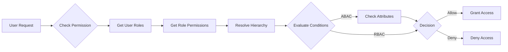

# Core Concepts Overview

Understanding RBAC Algorithm's architecture and key concepts.

## What is RBAC?

**Role-Based Access Control (RBAC)** is an access control method that assigns permissions to roles rather than individual users. Users are then assigned roles, inheriting all permissions associated with those roles.

### Traditional Access Control Problems

❌ **Direct User-Permission Assignment**
```
User A → Permission 1, 2, 3
User B → Permission 1, 2, 3, 4
User C → Permission 1, 2
```
*Managing hundreds of users becomes unmanageable*

✅ **Role-Based Assignment**
```
Role: Editor → Permission 1, 2, 3
User A, B, C → Role: Editor
```
*Easy to manage and audit*

## Core Components

import RoleHierarchyVisualizer from '@site/src/components/RoleHierarchyVisualizer';

### 1. Users (Subjects)

Entities that perform actions in your system.

```python
user = User(
    id="user_123",
    email="john@example.com",
    name="John Doe",
    attributes={"department": "engineering"}  # For ABAC
)
```

**Key Properties:**
- Unique identifier
- Email (must be unique)
- Custom attributes for ABAC conditions
- Optional domain for multi-tenancy

### 2. Permissions

Define **what action** can be performed on **what resource type**.

```python
permission = Permission(
    id="perm_doc_write",
    action="write",
    resource_type="document",
    conditions=[...]  # Optional ABAC conditions
)
```

**Components:**
- **Action**: read, write, delete, create, etc.
- **Resource Type**: document, user, project, etc.
- **Conditions**: Optional ABAC rules

### 3. Roles

Collections of permissions that represent job functions.

```python
role = Role(
    id="role_editor",
    name="Editor",
    description="Can edit documents",
    parent_id="role_viewer"  # Optional hierarchy
)
```

**Features:**
- Group related permissions
- Support inheritance hierarchies
- Reusable across users
- Can be temporary or permanent

### 4. Resources

Entities that access control applies to.

```python
resource = Resource(
    id="resource_doc_123",
    type="document",
    attributes={
        "owner_id": "user_456",
        "department": "engineering",
        "status": "published"
    }
)
```

**Purpose:**
- Represent protected entities
- Store attributes for ABAC evaluation
- Enable fine-grained access control

## Authorization Flow



### Step-by-Step:

1. **User makes request** to perform action on resource
2. **System retrieves** user's assigned roles
3. **Permissions are collected** from roles (including inherited)
4. **Hierarchy is resolved** to get all applicable permissions
5. **Conditions are evaluated** if ABAC is used
6. **Decision is made** - Allow or Deny
7. **Audit log recorded** (optional)

## RBAC vs ABAC

### RBAC (Role-Based Access Control)

✅ **Simple & Fast**
- Permissions based on roles
- Easy to understand and maintain
- Scales well for most use cases

```python
# Simple: User has Editor role → can write
if user.has_role("editor"):
    allow_write()
```

### ABAC (Attribute-Based Access Control)

✅ **Flexible & Fine-Grained**
- Dynamic conditions
- Context-aware decisions
- More complex but powerful

```python
# Dynamic: Can edit only if owner and during business hours
conditions = [
    {"field": "resource.owner_id", "operator": "==", "value": "{{user.id}}"},
    {"field": "time.hour", "operator": ">", "value": 8},
    {"field": "time.hour", "operator": "<", "value": 18}
]
```

### Best of Both Worlds

RBAC Algorithm **combines both approaches**:

```python
# Role provides base permissions
rbac.assign_role_to_user("user_123", "role_author")

# Permissions can have ABAC conditions
permission = rbac.create_permission(
    permission_id="perm_edit_own",
    action="edit",
    resource_type="document",
    conditions=[
        {"field": "resource.owner_id", "operator": "==", "value": "{{user.id}}"}
    ]
)
```

## Role Hierarchies

Roles can inherit from parent roles, creating organizational structures:

<RoleHierarchyVisualizer />

### Benefits:

1. **DRY Principle** - Define permissions once, inherit everywhere
2. **Organizational Modeling** - Mirrors real-world structures
3. **Easy Promotions** - Change one assignment, get new permissions
4. **Maintainability** - Update parent, all children get changes

### Example:

```python
# Create hierarchy
rbac.create_role("role_viewer", "Viewer")
rbac.create_role("role_editor", "Editor", parent_id="role_viewer")
rbac.create_role("role_admin", "Admin", parent_id="role_editor")

# Permissions propagate down
rbac.assign_permission_to_role("role_viewer", "perm_read")
# Editor automatically gets perm_read via inheritance
```

## Multi-Tenancy

Support for isolated tenants in SaaS applications:

```python
# Tenant A
rbac.create_user("user_a", "a@tenant-a.com", domain="tenant_a")
rbac.assign_role_to_user("user_a", "role_admin", domain="tenant_a")

# Tenant B
rbac.create_user("user_b", "b@tenant-b.com", domain="tenant_b")
rbac.assign_role_to_user("user_b", "role_admin", domain="tenant_b")

# Users can only access their tenant's resources
rbac.check_permission(
    user_id="user_a",
    action="read",
    resource_id="doc_in_tenant_b",
    domain="tenant_b"
)  # Returns False
```

## Storage Abstraction

Protocol-based architecture supports multiple backends:

- **In-Memory** - Fast, for development/testing
- **PostgreSQL** - Production-ready relational
- **MongoDB** - Document-based storage
- **Redis** - High-performance caching
- **Custom** - Implement `IStorageProvider` protocol

```python
# Swap storage without changing code
from rbac import RBAC
from rbac.storage import PostgreSQLStorage

storage = PostgreSQLStorage(connection_string="...")
rbac = RBAC(storage=storage)
```

## Performance Considerations

### Caching Strategy

```python
# Built-in caching for frequently accessed data
- User roles cached per user
- Role hierarchies cached
- Permissions cached per role
```

### Batch Operations

```python
# Check multiple permissions at once
results = rbac.batch_check([
    {"user_id": "user_1", "action": "read", "resource_id": "doc_1"},
    {"user_id": "user_1", "action": "write", "resource_id": "doc_1"},
    {"user_id": "user_2", "action": "read", "resource_id": "doc_1"}
])
```

## Security Best Practices

1. **Principle of Least Privilege** - Grant minimum necessary permissions
2. **Regular Audits** - Review role assignments periodically
3. **Temporary Access** - Use time-bound role assignments
4. **Domain Isolation** - Enforce multi-tenancy boundaries
5. **Deny by Default** - Explicit permissions required

## Next Steps

- 📚 [RBAC Basics](/docs/concepts/rbac-basics) - Deep dive into RBAC
- 🔐 [ABAC Guide](/docs/concepts/abac) - Attribute-based access
- 📊 [Role Hierarchies](/docs/concepts/role-hierarchy) - Inheritance patterns
- 🏢 [Multi-Tenancy](/docs/concepts/multi-tenancy) - SaaS applications
